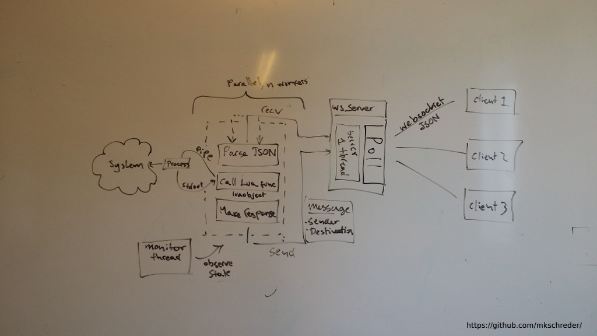

Juci RPC Server (OrangeRPCD)
--------------------------

OrangeRPCD is a lua scriptable and multithreaded JSONRPC application server
with websocket support on the frontend. It is fully portable and builds as part
of OpenWRT. 

Building
--------

	./autogen.sh
	./configure 
	make 

Core RPC API
------------

OrangeRPCD implements JSON RPC protocol as it is commonly defined. The protocol
thus supports four types of messages: 

	CALL:   {"jsonrpc":"2.0","id":1,"method":"...","params":[...]}
	RESULT: {"jsonrpc":"2.0","id":1,"result":{...}}
	ERROR:  {"jsonrpc":"2.0","id":1,"error":"..."}
	EVENT:  {"jsonrpc":"2.0","method":"...","params":[...]}

Any other messages are invalid and should be ignored by the server. 

Core RPC Methods
----------------

The top level RPC object is used for basic operations such as authentication,
listing available objects and calling application methods. Most of these are
implemented directly by the server.  

*challenge*

Used to get a login challenge for current connection. This challenge should
then be combined with sha1 digest of the user password and sent back to login
method for authentication.  

FORMAT: 
	"method":"challenge","params":[]

RESPONSE: 
	"result":{"token":"auth_token"}

*login*

Used to autneticate with the server. On successful login, this method responds
with session id for current session. 

FORMAT: 
	"method":"login","params":[username,chresponse]

RESULT: 
	"result":{"sid":"sessionid"}

*call*

Method for calling an object method. Permissions are automatically enforced by
the server. Application method may impose additional permission checks. 

Only tables are supported as arguments to a method.  

FORMAT: 
	"method":"call","params":[sid,object,method,{...}]

RESULT: 

On success, shall return JSON-RPC result object with same id as request and
result field set to the value returned by the application script. 

On failure, shall return JSON-RPC error object specifying error that occured. 

*list*

Lists all available objects and their methods. Can only be executed after
authenticating with the server. Takes either a path of the object to list, or a
wildcard "\*" used for listing all available objects. 

On success this method returns a table of all objects, their methods and
parameters for each method. 

FORMAT: 
	"method":"list","params":[sid,path]

RESULT: 
	"result":{"object":{"method":[args..]},...}

Access Control
--------------

RevoRPC implements scope based access control. Although additional capability
based access control is planned as well. The idea is that you application
defines an access list of essential function that it requires access to. For
example: 
	
	ubus /juci/network clients x 
	uci network * rw

	FORMAT: scope object method permission

Each application creates a list like that. Users are then granted access to a
list of applications and a list of capabilities. Access lists contain essential
permissions for proper functioning of application - just like permissions on
android. However, the capability lists are dynamic and a user can for example
have access to "system setpassword" but not have capability
"can-set-password-other-user" which would result in user only being able to
change his own password. 

Copying
-------

This software is distributed under GPLv3 license (see COPYING file) together
with additional permissions specified in the LICENSE file as authorized by
copyright holders below: 

Copyright (c) 2016 Martin K. Schröder <mkschreder.uk@gmail.com>

This program is free software: you can redistribute it and/or modify it under
the terms of the GNU General Public License as published by the Free Software
Foundation, either version 3 of the License, or (at your option) any later
version. 

This program is distributed in the hope that it will be useful, but WITHOUT ANY
WARRANTY; without even the implied warranty of MERCHANTABILITY or FITNESS FOR A
PARTICULAR PURPOSE.  See the GNU General Public License for more details.
			
